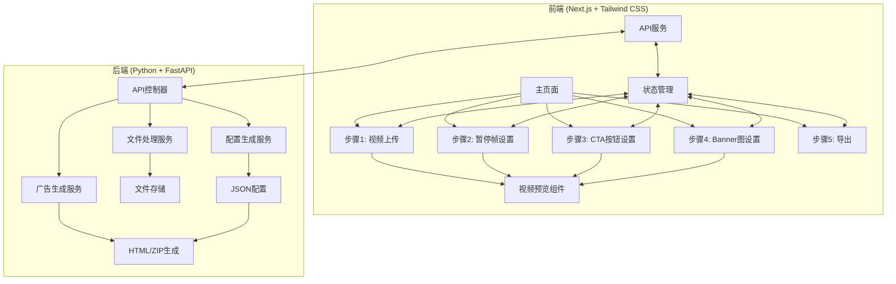
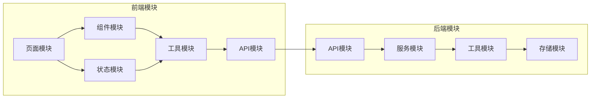
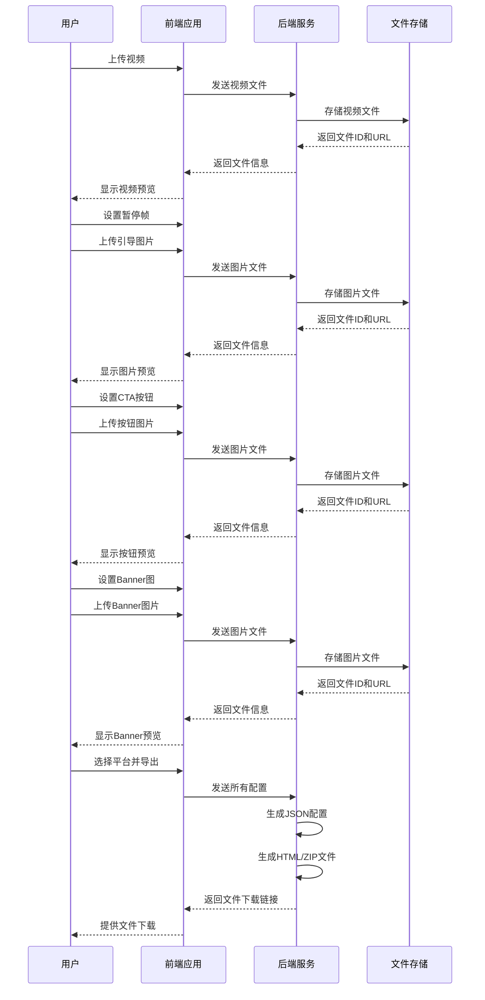

# Playable Ads Maker - 设计文档

## 整体架构图



## 分层设计和核心组件

### 前端分层

1. **表现层**
   - 页面组件：负责UI渲染和用户交互
   - 布局组件：处理响应式布局
   - 表单组件：处理用户输入

2. **业务逻辑层**
   - 状态管理：处理应用状态
   - 表单验证：验证用户输入
   - 步骤控制：管理多步骤流程

3. **数据访问层**
   - API服务：与后端通信
   - 文件处理：处理文件上传和下载

### 后端分层

1. **API层**
   - 路由控制：处理HTTP请求
   - 参数验证：验证请求参数
   - 响应格式化：统一响应格式

2. **服务层**
   - 文件服务：处理文件上传和存储
   - 配置服务：生成JSON配置
   - 生成服务：生成HTML和ZIP文件

3. **工具层**
   - 文件工具：处理文件操作
   - 模板工具：处理HTML模板
   - 压缩工具：处理ZIP打包

## 模块依赖关系图



## 接口契约定义

### 前端API接口

#### 1. 文件上传接口

```typescript
// 请求
interface UploadRequest {
  file: File;
  type: 'video' | 'image';
  step: 'video' | 'pause' | 'cta' | 'banner';
  position?: 'left' | 'right' | 'center'; // 对于图片位置
}

// 响应
interface UploadResponse {
  success: boolean;
  fileId: string;
  url: string;
  metadata?: {
    width?: number;
    height?: number;
    duration?: number; // 视频时长（秒）
    size: number;
    format: string;
  };
  error?: string;
}
```

#### 2. 生成广告接口

```typescript
// 请求
interface GenerateRequest {
  videoId: string;
  pauseFrames: {
    time: number; // 暂停时间点（秒）
    imageId: string; // 引导图片ID
    position: {
      left: number; // 左侧位置百分比
      top: number; // 顶部位置百分比
    };
  }[];
  ctaButtons: {
    type: 'fulltime' | 'endscreen';
    imageId: string;
    position: {
      left: number; // 左侧位置百分比
      top: number; // 顶部位置百分比
    };
    startTime?: number; // 对于结尾显示的按钮
  }[];
  banners?: {
    leftImageId?: string;
    rightImageId?: string;
  };
  platform: 'google' | 'facebook' | 'applovin';
}

// 响应
interface GenerateResponse {
  success: boolean;
  fileUrl?: string; // 生成文件的下载链接
  previewUrl?: string; // 预览链接
  error?: string;
}
```

### 后端API接口

#### 1. 文件上传接口

```python
# 请求
# POST /api/upload
# Content-Type: multipart/form-data

# 响应
{
  "success": bool,
  "file_id": str,
  "url": str,
  "metadata": {
    "width": int,  # 可选，图片/视频宽度
    "height": int,  # 可选，图片/视频高度
    "duration": float,  # 可选，视频时长（秒）
    "size": int,
    "format": str
  },
  "error": str  # 可选，错误信息
}
```

#### 2. 生成广告接口

```python
# 请求
# POST /api/generate
# Content-Type: application/json
{
  "video_id": str,
  "pause_frames": [
    {
      "time": float,  # 暂停时间点（秒）
      "image_id": str,  # 引导图片ID
      "position": {
        "left": float,  # 左侧位置百分比
        "top": float  # 顶部位置百分比
      }
    }
  ],
  "cta_buttons": [
    {
      "type": str,  # "fulltime" 或 "endscreen"
      "image_id": str,
      "position": {
        "left": float,  # 左侧位置百分比
        "top": float  # 顶部位置百分比
      },
      "start_time": float  # 可选，对于结尾显示的按钮
    }
  ],
  "banners": {  # 可选
    "left_image_id": str,  # 可选
    "right_image_id": str  # 可选
  },
  "platform": str  # "google", "facebook", "applovin"
}

# 响应
{
  "success": bool,
  "file_url": str,  # 可选，生成文件的下载链接
  "preview_url": str,  # 可选，预览链接
  "error": str  # 可选，错误信息
}
```

## 数据流向图



## 异常处理策略

### 前端异常处理

1. **网络错误**
   - 重试机制：自动重试失败的API请求
   - 离线检测：检测网络状态并提示用户
   - 错误提示：显示友好的错误消息

2. **文件处理错误**
   - 文件类型验证：前端验证文件类型和大小
   - 上传进度：显示上传进度和状态
   - 上传失败处理：允许用户重新上传

3. **用户输入错误**
   - 表单验证：实时验证用户输入
   - 错误提示：显示具体的错误信息
   - 自动修正：在可能的情况下自动修正输入

### 后端异常处理

1. **请求验证**
   - 参数验证：验证请求参数的完整性和正确性
   - 权限验证：验证API访问权限
   - 错误响应：返回标准化的错误响应

2. **文件处理**
   - 文件验证：验证文件类型和内容
   - 存储错误：处理文件存储失败的情况
   - 资源清理：在处理失败时清理临时文件

3. **生成过程**
   - 超时处理：处理生成过程超时
   - 资源限制：限制资源使用
   - 部分成功：处理部分成功的情况 