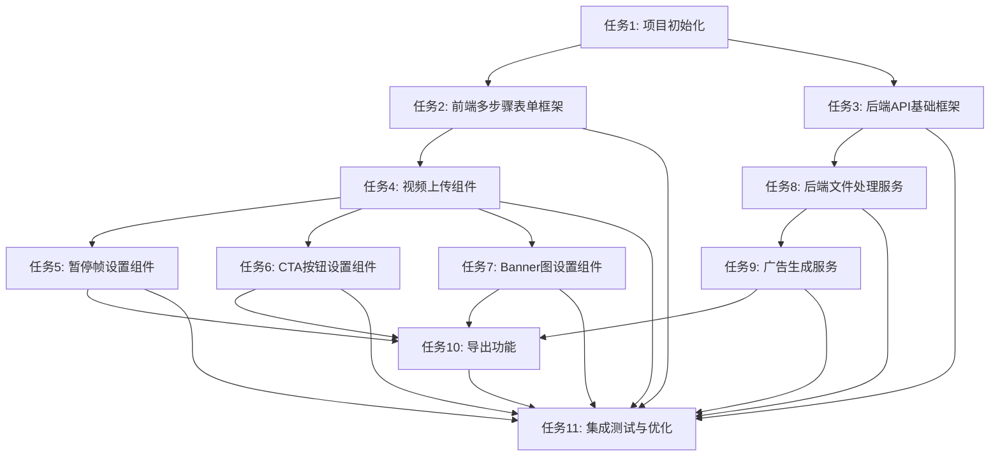

# Playable Ads Maker - 任务拆分

## 子任务拆分

### 任务1：项目初始化与基础架构搭建

**输入契约**：
- 技术栈要求：Next.js、Tailwind CSS、FastAPI
- 设计文档和架构图

**输出契约**：
- 前端项目基础结构
- 后端项目基础结构
- 基础配置文件
- 开发环境设置

**实现约束**：
- 使用Next.js 13+（App Router）
- 使用TypeScript进行类型检查
- 使用Tailwind CSS进行样式设计
- 使用Python 3.9+和FastAPI

**依赖关系**：
- 无前置依赖
- 后置任务：任务2、任务3

### 任务2：前端多步骤表单框架实现

**输入契约**：
- 任务1的项目基础结构
- 设计文档中的UI流程和交互设计

**输出契约**：
- 多步骤表单框架
- 步骤导航组件
- 响应式布局实现
- 状态管理设置

**实现约束**：
- 使用React Hooks管理状态
- 实现响应式设计，支持PC和移动端
- 遵循Tailwind CSS最佳实践

**依赖关系**：
- 前置依赖：任务1
- 后置任务：任务4、任务5、任务6、任务7

### 任务3：后端API基础框架实现

**输入契约**：
- 任务1的项目基础结构
- 设计文档中的API接口定义

**输出契约**：
- API路由设置
- 请求验证中间件
- 响应格式化工具
- 文件上传处理基础设施

**实现约束**：
- 使用FastAPI路由系统
- 实现请求验证和错误处理
- 设计统一的响应格式

**依赖关系**：
- 前置依赖：任务1
- 后置任务：任务8、任务9

### 任务4：视频上传组件实现（步骤一）

**输入契约**：
- 任务2的多步骤表单框架
- 设计文档中的视频上传需求

**输出契约**：
- 视频上传组件
- 视频预览功能
- 视频信息显示（时长、大小等）
- 与后端API集成

**实现约束**：
- 支持拖放上传
- 实现文件类型和大小验证
- 显示上传进度
- 优化大文件上传性能

**依赖关系**：
- 前置依赖：任务2
- 后置任务：任务5、任务6、任务7

### 任务5：暂停帧设置组件实现（步骤二）

**输入契约**：
- 任务2的多步骤表单框架
- 任务4的视频预览功能
- 设计文档中的暂停帧设置需求

**输出契约**：
- 暂停时间设置控件
- 引导图片上传组件
- 位置设置控件（左侧和顶部百分比）
- 暂停效果预览

**实现约束**：
- 基于上传的视频进行时间点选择
- 实现图片上传和预览
- 实现拖拽定位功能
- 与状态管理系统集成

**依赖关系**：
- 前置依赖：任务2、任务4
- 后置任务：任务10

### 任务6：CTA按钮设置组件实现（步骤三）

**输入契约**：
- 任务2的多步骤表单框架
- 任务4的视频预览功能
- 设计文档中的CTA按钮设置需求

**输出契约**：
- 按钮类型选择（全程显示/结尾显示）
- CTA图片上传组件
- 位置设置控件
- 时间设置控件（对于结尾显示）
- 按钮效果预览

**实现约束**：
- 基于上传的视频进行位置和时间设置
- 实现图片上传和预览
- 实现拖拽定位功能
- 与状态管理系统集成

**依赖关系**：
- 前置依赖：任务2、任务4
- 后置任务：任务10

### 任务7：Banner图设置组件实现（步骤四）

**输入契约**：
- 任务2的多步骤表单框架
- 任务4的视频预览功能
- 设计文档中的Banner图设置需求

**输出契约**：
- 左侧Banner图上传组件
- 右侧Banner图上传组件
- Banner效果预览

**实现约束**：
- 实现图片上传和预览
- 与状态管理系统集成
- 适配横屏显示

**依赖关系**：
- 前置依赖：任务2、任务4
- 后置任务：任务10

### 任务8：后端文件处理服务实现

**输入契约**：
- 任务3的后端API基础框架
- 设计文档中的文件处理需求

**输出契约**：
- 文件上传处理服务
- 文件存储服务
- 文件元数据提取（视频时长、尺寸等）
- 文件URL生成

**实现约束**：
- 支持大文件上传
- 实现文件类型验证和安全检查
- 优化存储策略
- 处理并发上传

**依赖关系**：
- 前置依赖：任务3
- 后置任务：任务9

### 任务9：广告生成服务实现

**输入契约**：
- 任务3的后端API基础框架
- 任务8的文件处理服务
- 设计文档中的广告生成需求

**输出契约**：
- JSON配置生成服务
- HTML模板系统
- ZIP打包服务
- 平台适配服务（Google、Facebook、Applovin）

**实现约束**：
- 实现模板化HTML生成
- 支持不同平台的特殊要求
- 优化生成性能
- 实现错误处理和恢复机制

**依赖关系**：
- 前置依赖：任务3、任务8
- 后置任务：任务10

### 任务10：导出功能实现（步骤五）

**输入契约**：
- 任务2的多步骤表单框架
- 任务5、6、7的设置数据
- 任务9的广告生成服务
- 设计文档中的导出功能需求

**输出契约**：
- 平台选择组件
- 生成预览功能
- 文件下载功能
- 生成状态提示

**实现约束**：
- 集成所有前面步骤的数据
- 实现与后端生成服务的通信
- 优化下载体验
- 处理生成过程中的错误

**依赖关系**：
- 前置依赖：任务5、任务6、任务7、任务9
- 无后置依赖

### 任务11：集成测试与优化

**输入契约**：
- 所有前面任务的完成结果
- 设计文档中的验收标准

**输出契约**：
- 完整的端到端测试
- 性能优化报告
- 用户体验改进
- 浏览器兼容性测试报告

**实现约束**：
- 测试覆盖所有核心功能
- 优化页面加载性能
- 优化文件上传和下载性能
- 确保主流浏览器兼容性

**依赖关系**：
- 前置依赖：任务1-10
- 无后置依赖

## 任务依赖图

## 复杂度评估

| 任务ID | 任务名称 | 复杂度 | 预估工时 |
|--------|---------|--------|---------|
| 1 | 项目初始化与基础架构搭建 | 中 | 1天 |
| 2 | 前端多步骤表单框架实现 | 中 | 1天 |
| 3 | 后端API基础框架实现 | 中 | 1天 |
| 4 | 视频上传组件实现 | 高 | 2天 |
| 5 | 暂停帧设置组件实现 | 高 | 2天 |
| 6 | CTA按钮设置组件实现 | 中 | 1.5天 |
| 7 | Banner图设置组件实现 | 低 | 1天 |
| 8 | 后端文件处理服务实现 | 高 | 2天 |
| 9 | 广告生成服务实现 | 高 | 3天 |
| 10 | 导出功能实现 | 中 | 1.5天 |
| 11 | 集成测试与优化 | 中 | 2天 |
| | **总计** | | **18天** | 